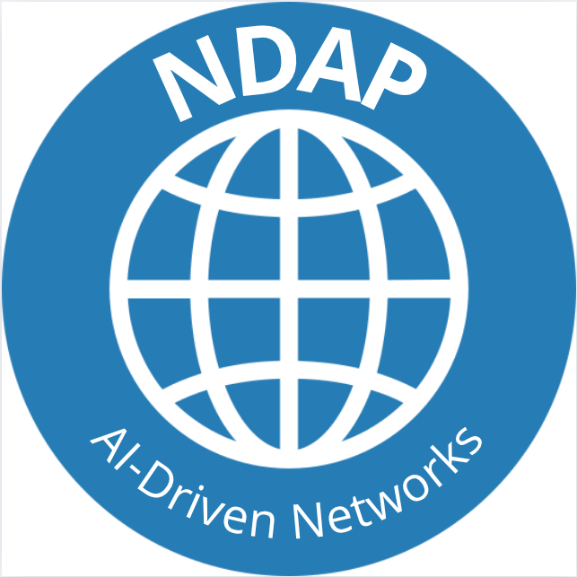

# Fase: MS4

## Método
**Presencial**

## Duração
**14:00 - 15:00**

## Supervisores presentes
- Rafael Teixeira ✔️
- Rafael Direito ✔️

## Membros presentes
- Rodrigo Abreu ✔️
- Eduardo Lopes ✔️
- João Neto ✔️
- Hugo Ribeiro ✔️
- Jorge Domingues ✔️

## Assuntos discutidos
- APIs 5G
- Implementação dos algoritmos de ML

## Resumo

### ML 
- Pull periodico
- Meter ML Training a consumir do topico dos dados processados
- trigger do retraining
- dividir dados "stratified split" 
- Model as a Service
- Guardar em memória a performance do modelo.

### APIs 5G
- Equilibrar a velocidade de consumo dos pacotes, é importante não abrandar o 5G.
- Meter a parte de ML integrada com o 5G.
- Conseguir decidir qual modelo treinar pelas apis, obter os resultados de cada um e escolher o modelo certo de acordo com os dados.
- Usar só o que precisamos do payload.
- Identificar falhas das especificações.
- Analisar melhor as 3 APIs de ML (provision, training e monitor)
- Analisar os esquemas das APIs, uma vez q são recentes, estes podem ser um pouco incompletos
- Documentar todas as alterações feitas nos esquemas utilizados ("crítica construtiva" para melhorar as TS)
- Testar bem as APIs para garantir que não introduzem atraso na rede 5G

Análise do Abstract para o students@deti

## Notas

## Ficheiros Relacionados

- Logo para o students@deti 

- students@deti abstract

> Modern networks have evolved from static infrastructures into dynamic, intelligent, and adaptive systems. 5G and Beyond 5G networks need to handle large volumes of data, support a wide variety of applications, and ensure high reliability and low latency. However, increased data flow can degrade network performance, and usage spikes may compromise service quality. Additionally, technical challenges such as high latency and packet loss affect data transmission, while physically expanding infrastructure requires large investment.
To address these challenges, this work proposes the development of a scalable and modular MLOps pipeline capable of integrating machine learning and automation to optimize networks. The system will be designed to identify patterns within the network, facilitating adaptive optimization and automated decision-making.
Our case study focuses on anomaly detection, a critical function for maintaining optimal network performance and security. By leveraging machine learning models within the MLOps pipeline, the system can identify nine types of attacks amidst benign traffic. This approach minimizes service disruptions, enhances reliability, and supports the network’s capacity to self-heal and adapt to varying conditions, ensuring consistent quality of service across diverse and demanding applications. 
