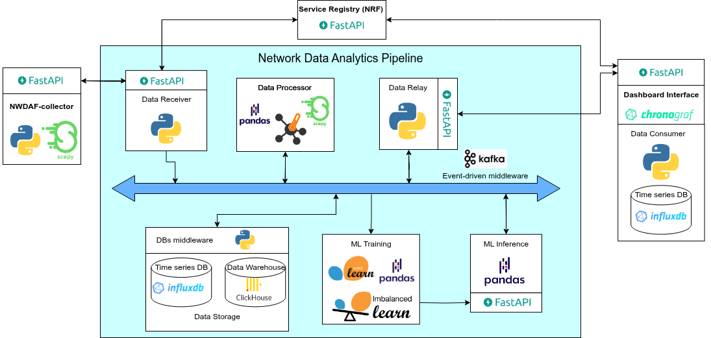

# Fase: MS4

## Método
**Presencial**

## Duração
**9:00 - 10:00**

## Supervisores presentes
- Rafael Teixeira ✔️
- Rafael Direito (remoto) ✔️

## Membros presentes
- Rodrigo Abreu ✔️
- Eduardo Lopes ✔️
- João Neto (remoto) ✔️
- Hugo Ribeiro (remoto) ✔️
- Jorge Domingues ✔️

## Assuntos discutidos
- Implementação dos algoritmos de ML
- APIs 5G

## Resumo

### ML 
- deixar algumas coisas que temos conhecimento
- fazer plot da accuracy do modelo ao longo do tempo
- graficos é uma boa solução para mostrar o nosso trabalho
- fazer hiperparameterização
- dar trigger ao retraining quando se deteta um novo ataque.
- temos de dar numeros que impressionem para vender o nosso trabalho.
- ilustrar complexidade

### APIs 5G
- subscrever um modelo deployed e fazia alerta para uma api externa
- usar webhooks para simplificar
- focar no re-training e ignorar a parte de monitoring
- Implementar API para treino por pedido para permitir que o operador de rede consiga analisar a evolução dos modelos com a mudança dos dados
- API recente, logo os seus esquemas são limitados relativamente aos dados q ela permite expor
- Esta API dá valor ao trabalho porque aproxima a nossa parte de ML a aquilo q realmente se verifica nas especificações (TS) da NWDAF

## Notas
- Esta reunião teve uma primeira parte com o orientador Rafael Teixeira presencialmente, com todos os elementos do grupo presentes (uns remotamente e outros presencialmente).
Segunda parte da reunião foi remotamente com o orientador Rafael Direito mais focada na área de 5G e apenas os seguintes elementos do grupo estiveram presentes: Rodrigo, Eduardo e Jorge.
- Atualizar arquitetura.
- Preparar o checkpoint 3.

## Ficheiros relacionados

- Arquitetura atualizada

