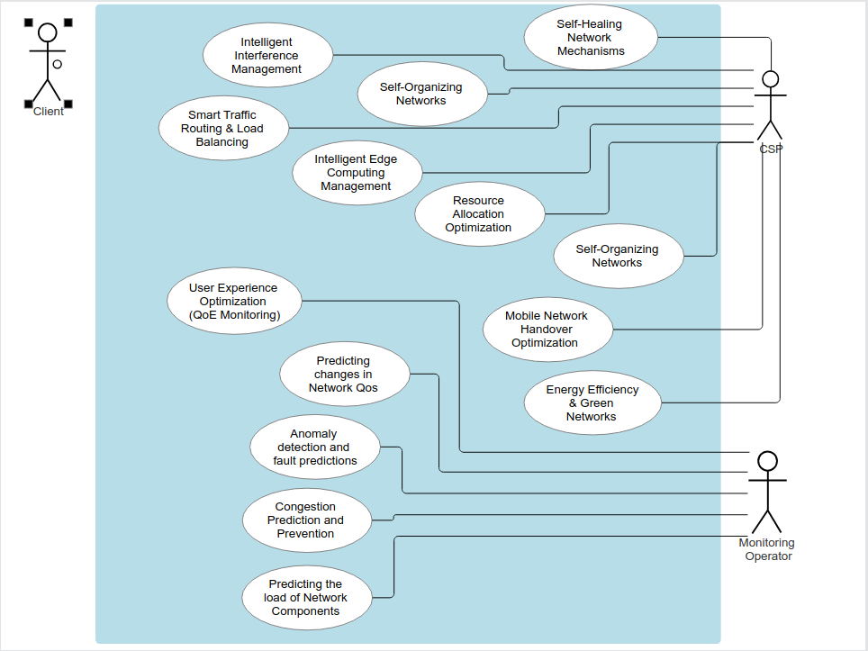
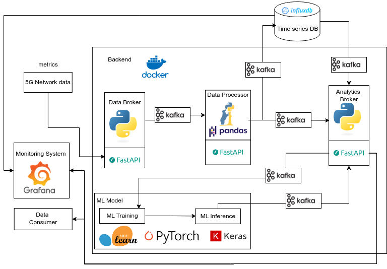
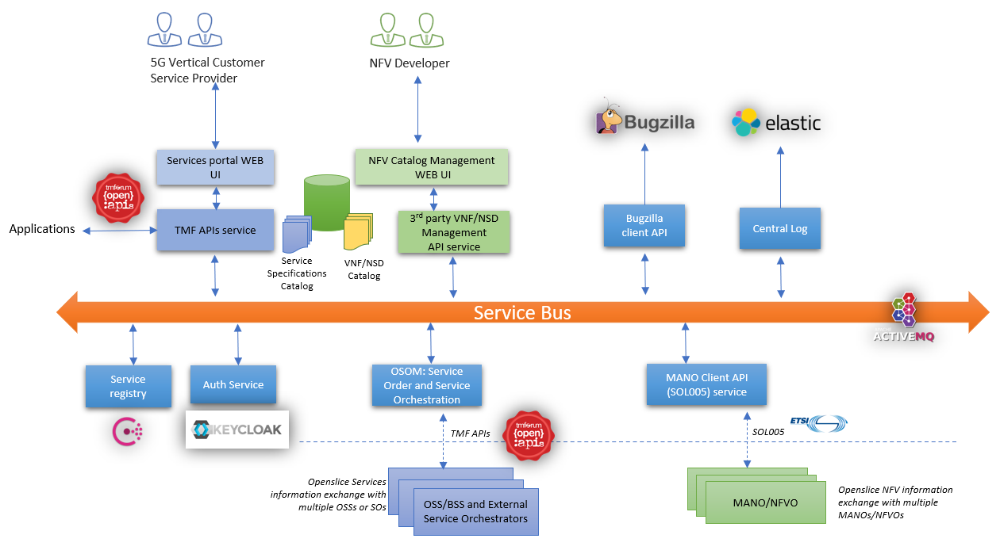

# Fase: MS2

## Método
**Presencial**

## Duração
**9:00 - 10:00**

## Supervisores presentes
- Rafael Teixeira ✔️
- Rafael Direito ✔️

## Membros presentes
- Rodrigo Abreu ✔️
- Eduardo Lopes ✔️
- João Neto ✔️
- Hugo Ribeiro ✔️
- Jorge Domingues (remoto) ✔️

## Assuntos discutidos
- Considerações sobre a integração com o core 5G.
- Atores e cenários.
- Arquitetura
- Use Cases
- Mockups da monitoring interface.
- Apresentação do SCRUM Board.

## Resumo

Sobre a integração com o core 5G:
- É importante descobrir as interfaces e depois encontrar API.
- Focar no pipeline.
- Importante identificar que interfaces teria de ter para a comunicação entre os componentes e depois qual deveriamos implementar.

Em relação aos casos de uso, apresentámos os levantados e um exemplo de um diagrams (segue em anexo):

Feedback dos tutores:
- retirar alguns (está muito exaustivo).
- Pôr só 2 atores. Network/service provider e client para simplificar.
- Conectar os que se relacionam com o client a ele.
- No relatório apresentar todos os casos de uso, mas só implementar alguns. Os que serão implementados já darão trabalho suficiente.
- Focar no caso de uso "anomaly detection".

Alguma informação do tutor Rafael Teixeira sobre o ML Ops pipeline:
- Tutor Rafael Teixeira vai fornecer um dataset para identificar-mos as métricas a usar no modelo.
- Dados raw são por exemplo, os recolhidos pelo wireshark a correr na rede.
- Ips, pedidos de conexão, etc. Traduzir isto para métricas.
- Output é suposto ser um csv. Este deve ser já processado e raw.
- Precisamos de um data warehouse para provenance.

Foi apresentado uma ideia da arquitetura aos orientadores (segue em anexo).

Feedback dos tutores: 
- Organizar melhor o diagrama. Exemplo da arquitetura openslice como guia (segue em anexo).
- Temos de ter API no ML Model.
- Meter o monitoring system e o ML Model à direita.
- Manter a time series DB, é útil para o segundo caso de uso que será implementado.
- Como fazer a gestão do treino? -> Ter data warehouse para guardar dados processados.

Mockups da Monitoring Interface?

Feedback dos tutores:
- Levar uns exemplos da interface de monitoring, embora o projeto não esteja muito virado para estes moldes.
- Justificar a falta de mockups. Especificar que o projeto é virado para o backend e o único dashboard que temos é o grafana.

Foi-nos apresentado também um bom sistema de previsão de QoS e Assurance -> Facebook Prophet.

- Apresentação do SCRUM Board do projeto para os tutores conseguirem acompanhar o progresso.

## Notas
- Daqui em diante fazer a parte correspondente à apresentação na documentação, antes da apresentação.
- Anotar as dúvidas nos pdfs do 3GPP para ser analisado pelo tutor Rafael Direito.
- Data lake: dados raw. Data warehouse: dados processados.
- Tentar ter esta milestone concluída sexta para os tutores avaliarem e termos tempo de corrigir coisas atempadamente.

## Ficheiros relacionados
- Ideia de Diagrama de Casos apresentada

- Ideia de Arquitetura apresentada

- Arquitetura Openslice
