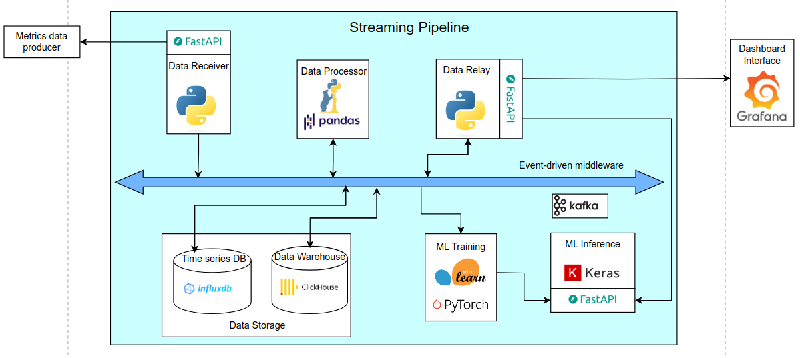

# Fase: MS2

## Método
**Presencial**

## Duração
**10:00 - 11:00**

## Supervisores presentes
- Rafael Teixeira ✔️
- Rafael Direito ✔️

## Membros presentes
- Rodrigo Abreu ✔️
- Eduardo Lopes ✔️
- João Neto (remoto)✔️
- Hugo Ribeiro ✔️
- Jorge Domingues ✔️

## Assuntos discutidos
- Apresentação do powerpoint da MS2.

## Resumo
Análise dos orientadores ao Powerpoint:

Contexto e estado da arte:
- Estado da arte da NWDAF. Precisamos de ML porque é o estado da arte da implementação.
- 5G precisa de ML, Solução NWDAF (SoA) e depois dizer o que vamos fazer. 
- Distanciar da NWDAF.
- SoA tirar umas conclusões da cada paper.

Casos de Uso:
- Exportar o diagrama com svg.
- Mudar o cenario -> slide dá ideia que o cenario é ataques a robos. Tirar o svg do robô.

Requirements:
- Pequenos ajustes em alguns.
- Redução de alguns, para ficarem apenas os principais.

Non-functional:
- Meter os requisistos com medidas a serio, eram pouco objetivas.

Arquitetura: 
- meter em svg também.
- meter a seta bidirecional no metrics.
- Chronograph em vez do grafana.
- Dashboard interface subscribe. (seta nos 2 sentidos).
- Meter middleware entre o kafka e as BDs.

Mockups

Slide 1.
- meter metricas mais corretas.
- current anomaly rate -> average anomaly probability.
- meter uplink e downlink.

Slide 2.
- jitter -> time series.
- tirar heatmaps.

Slide 3. 
- Cuidados com os ips. 
- Meter tudo TCP.

## Notas
- Fazer os ajustes necessários ao powerpoint.
- Atualizar o microsite com as coisas da MS2.
- Preparar a apresentação da MS2.
- Atenção à gestão do tempo. (Temos muitos slides).

## Ficheiros relacionados
- Arquitetura antes das alterações:

- Arquitetura depois das alterações (Versão MS2):

