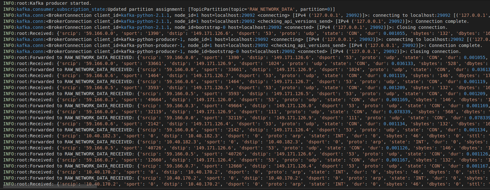
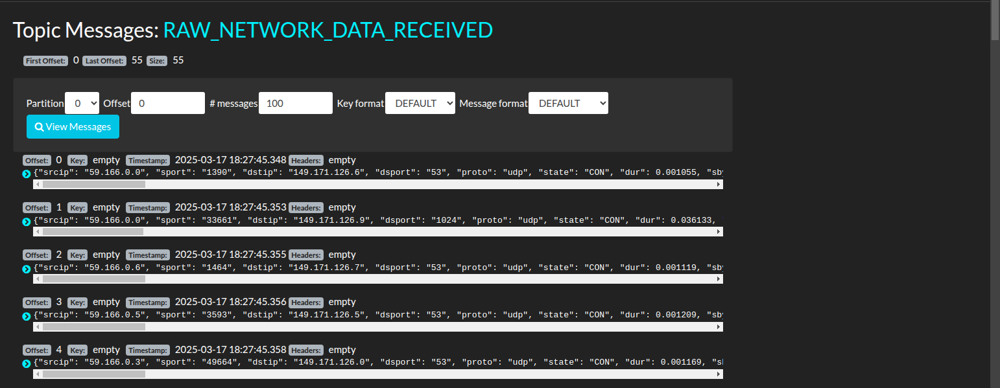
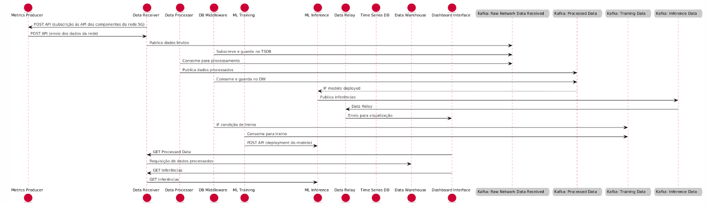

# Fase: MS3

## Método
**Presencial**

## Duração
**9:00 - 10:00**

## Supervisores presentes
- Rafael Teixeira ✔️
- Rafael Direito ✔️

## Membros presentes
- Rodrigo Abreu ✔️
- Eduardo Lopes ✔️
- João Neto ❌
- Hugo Ribeiro ✔️
- Jorge Domingues ✔️

## Assuntos discutidos
- Data Processor
- Dataset
- Estado da implementação
- Diagrama de fluxo de dados
- Apresentação checkpoint 1

## Resumo

### Data Processor

Não mandar as features que o modelo não vai usar.

Se mandarmos os ips vai fazer bias ao modelo.
3 opções:
- eliminar tudo o que não preciso (melhor no nosso caso)
- método para preencher os dados 
- definir como não possivel (pior no nosso caso)

Guardar dados em tabela ou csv no data warehouse?

Orientador Rafel Teixeira: "Para o modelo é melhor os dados tabelados, então devemos guardar tabelados."

O modelo nunca aceita strings, o modelo aceita números.

Não preocupar com isso para já, há ferramentas que transformam automaticamente.

### Dataset
Conseguimos tirar daqui o que é preciso:
- descrição dos features
- como obteram os dados
- etc

paper associado: https://link.springer.com/article/10.1007/s11036-021-01843-0

usar o outro csv para dados raw.

usar este para ver os dados pré-processados: https://espace.library.uq.edu.au/view/UQ:ffbb0c1

### Implementação
- ler pcaps em vez de csv
- alterar data producer, receiver, etc
- pcaps devem ser convertidos em algo para pôr no kafka

### Diagrama de sequência
- colocar kafka no meio e não separar em tópicos.
- colocar nrf (service registry). Prof. Aguiar falou disso.
- colocar tudo em inglês.

### Apresentação checkpoint 1
- diagrama de fluxo dos dados deve ser o primeiro a ser apresentado.
- mostrar a arquitetura do mvp e o que já foi feito.
- Adicionar divisão de trabalho (coisas do github project)

## Notas
- Fazer a apresentação ASAP.
- Importante fazer o refactoring para os pcaps rapido, para implementar o resto das features.

## Ficheiros relacionados
- Logs avaliados

- Diagrama do fluxo de dados
